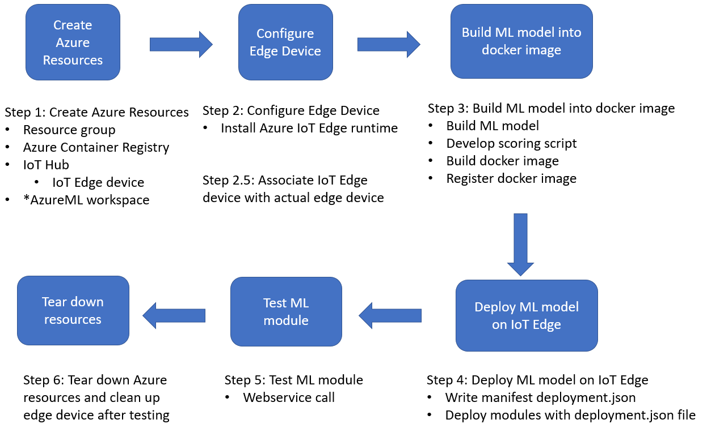

# Deploy Machine Learning Models on Azure IoT Edge

This repository contains examples and best practices for deploying machine learning (ML) models on Azure IoT Edge, provided as Jupyter notebooks. 


The table below lists the workflow options currently available in the repository. The examples detail our learnings on two key qustions: where the model is built and what is the IoT Edge device for deployment. Notebooks are linked under the `Workflow` column when different implementations are available.

Workflow| Task | Model Built Environment | IoT Edge Device | Description | Notes|
| --- | --- | --- | --- | --- | --- |
[wf1](./object-detection-azureml)| Object Detection | Azure Machine Learning | Ubuntu VM | Pytorch, pretrained MaskRCNN model | |
[wf2](./object-detection-acv)| Object Detection | Azure Custom Vision service | Ubuntu VM | Tensorflow, pretrained model, fine-tuned with 50 custom images| |
[wf3](./object-detection-acv-dbe)| Object Detection | Azure Custom Vision service | Data Box Edge (DBE) | Tensorflow, pretrained model, fine-tuned with 50 custom images |Make sure p2 works first then try p3 with the same model.|

The notebooks in each workflow directory is organized with six steps, which are illustrated in following digram.  
. 

We perform following steps for each ML model deployment scenario. The naming of the notebooks starts with `01`,`02`,`03`, ..., which match these steps. In some senario more than one notebooks are needed, we apply another level of numbers. For example, we use `031`,`032`,`033`... to represent the sub-steps of Step 3. 

- Step 1: Create Azure Resources
- Step 2: Configure Edge Device
- Step 3: Build ML model into docker image
- Step 4: Deploy ML model on IoT Edge
- Step 5: Test ML module
- Step 6: Tear down resources

## Prerequisites

1. Linux (x64) 
2. [Anaconda Python](https://www.anaconda.com/download)
3. [Docker](https://docs.docker.com/v17.12/install/linux/docker-ee/ubuntu) installed
4. [Azure account](https://azure.microsoft.com)

The tutorial was developed on an [Azure Ubuntu
DSVM](https://docs.microsoft.com/en-us/azure/machine-learning/data-science-virtual-machine/dsvm-ubuntu-intro),
which addresses the first three prerequisites.

## Setup

Please follow these steps to set up your environment and run notebooks.  They setup the notebooks to use Docker and Azure seamlessly.

1. Add your user to the docker group: 
   ```
   sudo usermod -aG docker $USER
   newgrp docker
   ```
   To verify whether you have correct configuration, try executing `docker ps` command. You should not get `permission denied` errors.

2. Navigate to the corresponding workflow directory that you have chosen.

3. Create the Python virtual environment using the environment.yml:
   ```
   conda env create -f environment.yml
   ```
4. Activate the virtual environment:
   ```
   source activate deployment_env
   ```
5. Login to Azure:
   ```
   az login
   ```
6. If you have more than one Azure subscription, select it:
   ```
   az account set --subscription <Your Azure Subscription>
   ```
7. Start the Jupyter notebook server in the virtual environment:
   ```
   jupyter notebook
   ```
8. Select correct kernel: set the kernel to be `Python [conda env: deployment_aml]`(or `Python 3` if that option does not show).

9. After following the setup instructions above, run the Jupyter notebooks in the order of `01`,`02`,`03`... in the chosen workflow.


## Reference
[Sample - Custom Vision + Azure IoT Edge](https://azure.microsoft.com/en-us/resources/samples/custom-vision-service-iot-edge-raspberry-pi/)


## Contributing

This project welcomes contributions and suggestions.  Most contributions require you to agree to a
Contributor License Agreement (CLA) declaring that you have the right to, and actually do, grant us
the rights to use your contribution. For details, visit https://cla.opensource.microsoft.com.

When you submit a pull request, a CLA bot will automatically determine whether you need to provide
a CLA and decorate the PR appropriately (e.g., status check, comment). Simply follow the instructions
provided by the bot. You will only need to do this once across all repos using our CLA.

This project has adopted the [Microsoft Open Source Code of Conduct](https://opensource.microsoft.com/codeofconduct/).
For more information see the [Code of Conduct FAQ](https://opensource.microsoft.com/codeofconduct/faq/) or
contact [opencode@microsoft.com](mailto:opencode@microsoft.com) with any additional questions or comments.
